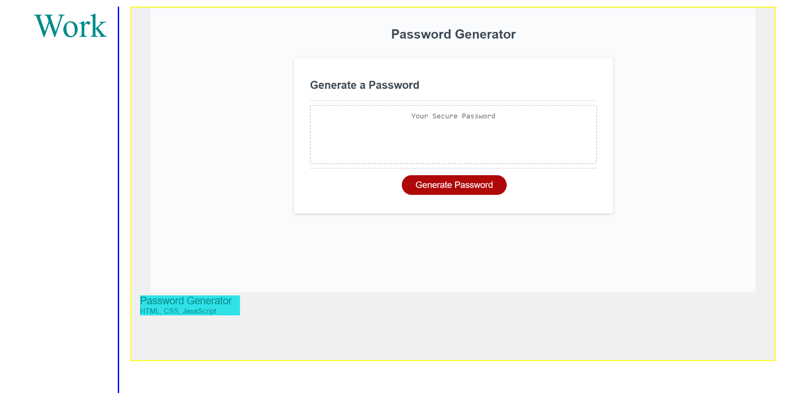
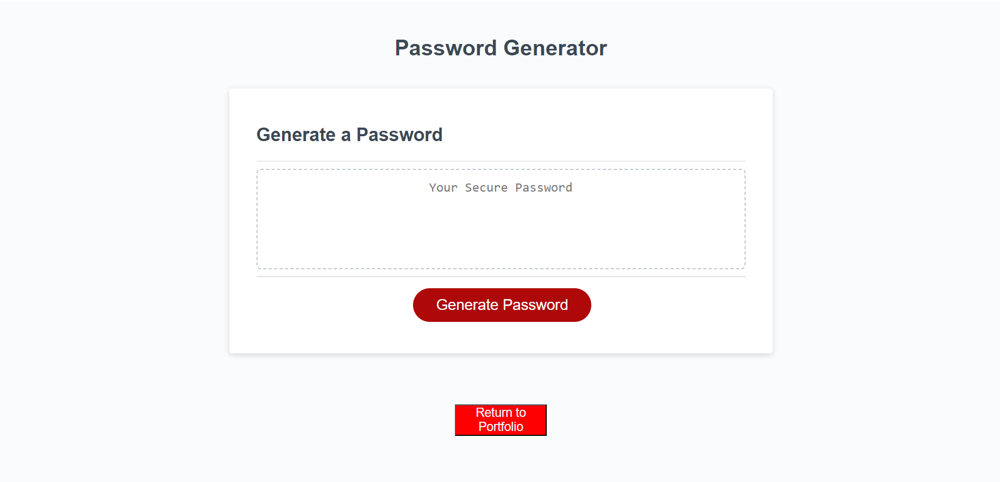
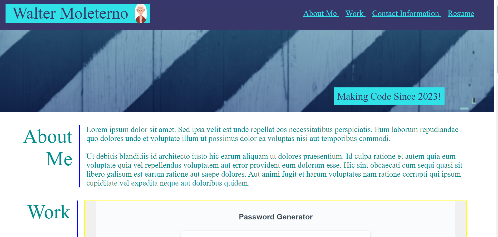
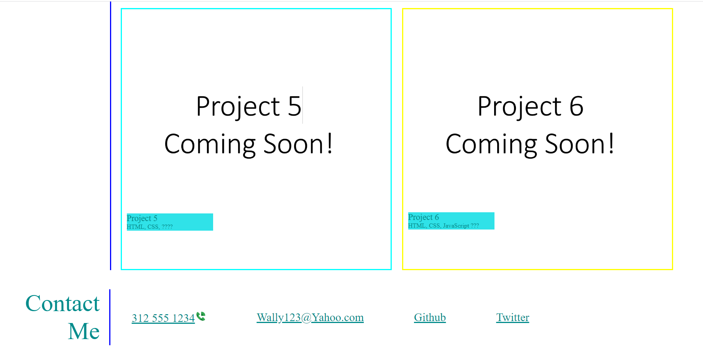

# Portfolio
Bootcamp Portfolio

This project consists of a portfolio that highlights some of the projects I produced during the last nine weeks of bootcamp. 

The portfolio will act as a showcase for the projects I completed during the boot camp.

As they say a picture is worth 1000 words and this portfolio will provide the pictures to fully communicate my newly acquired skills to potential employers. Hopefully as this portfolio matures, my skills will meet the requirements for employment. The problem it solves is to provide the method to effectively communicate my skills to multiple employees. It also provides contact information to employers should they decide to follow up in the future.

Installation is not required as the application is implied fully employed on the internet. One has only to click on the URL  https://boilermaker74.github.io/  to deploy the application. 

The user is presented with tiles that describe applications. 

By clicking on these tiles, the portfolio disappears and is replaced by the application itself.

To date only the first application, the password generator, is operational. Hopefully more applications will be added in the coming weeks. 

Anchor elements at the top right of the document will, when clicked on, bring the user to their corrosponding sections of the portfolio.

In my opinion, the best way to learn coding is to code.  As I started the program, problems arose that I hadn’t even envisioned. 

I learned that certain attributes have more features that I realized.  For example, the anchor element with its Href, I learned, can not only point to web addresses but also to elements in the application being worked on. So I could put an anchor element at the top of the document which moves the user And it's to an area on the bottom of the document.

So with the completion of this project, I am hopefully becoming more fluent in coding.
